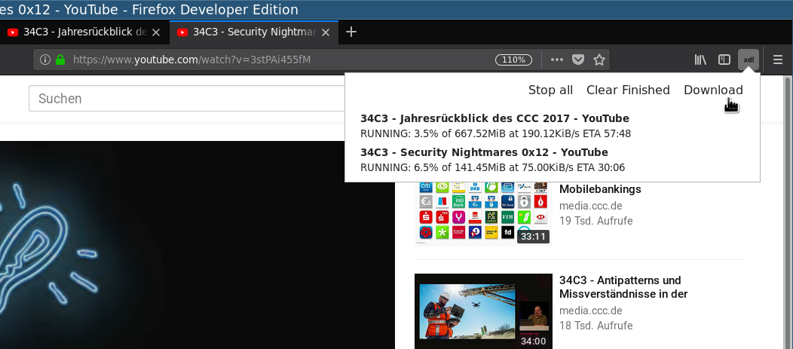

# ydl

firefox web extension to download media using youtube-dl via a python adapter

## Not plug and play ready

This is just me sharing the code. This project **requires manual installation of youtube-dl and modification of path strings**. You should be willing to do this before considering to use it.

## Requirements

* **linux** (debian)
* python3
* youtube-dl – [https://github.com/rg3/youtube-dl](https://github.com/rg3/youtube-dl)

## Installation

1. Make sure ``youtube-dl`` is installed
1. Copy ``youtube-dl-adapter`` e.g. to ``/opt/bin/``
1. Edit the file and modify the ``download_directory`` variable if you like.
    * Check the path of ``youtube_dl_path``
1. Make it executable ``chmod a+x /opt/bin/youtube-dl-adapter``.
1. Check or modify that the ``path`` entry of ``youtube-dl-adapter.json`` resembles the install location of the file ``youtube-dl-adapter`` script. Here ``/opt/bin/youtube-dl-adapter``
1. Check that the adapter works in general. There is a little debug cli option.
   ``/opt/bin/youtube-dl-adapter --url "https://www.  youtube.com/watch?v=hzoABukGVHE"``
   
    _It should print something like that:_
   
        {"action": "status", "data": [{"id": 0, "url": "https://www.youtube.com/watch?v=hzoABukGVHE", "title": "cli", "state": "RUNNING", "status_text": "starting"}]}{"action": "status", "data": [{"id": 0, "url": "https://www.youtube.com/watch?v=hzoABukGVHE", "title": "cli", "state": "RUNNING", "status_text": "Destination: /home/user/youtube-dl-downloads/34C3_-_Hacker_Jeopardy.f137.mp4\n"}]}
        …
    
    Don't mind unprintable chars. Quit using ``ctrl+c``.
    
1. Copy the native app description to the respective firefox directory [[doc]](https://developer.mozilla.org/en-US/Add-ons/WebExtensions/Native_manifests#Manifest_location)
    
        mkdir -p ~/.mozilla/native-messaging-hosts/
        cp youtube-dl-adapter.json ~/.mozilla/native-messaging-hosts/youtubedladapter.json
    
1. Start / restart firefox
1. Install the plugin using [about:addons](about:addons) → _Install Add-on From File_
    * Use ``xdl-*-an+fx.xpi`` from https://github.com/dedeibel/ydl/releases/latest
    * *Or* use temporary install to activate the plugin, select ``manifest.json`` from the checkout
        - [https://developer.mozilla.org/en-US/Add-ons/WebExtensions/Temporary_Installation_in_Firefox](https://developer.mozilla.org/en-US/Add-ons/WebExtensions/Temporary_Installation_in_Firefox)

## Screenshot

## Troubleshoot

* ``Disconnected due to an error: An unexpected error occurred``
    * Means the adapter script is not found or executable
* ``Disconnected due to an error: No such native application youtubedladapter``
    * Means the native application file is not properly installed or the app ``id`` and ``allowed_extensions`` list do not match
* The firefox webextensions site should be a good resource for research [https://developer.mozilla.org/en-US/Add-ons/WebExtensions](https://developer.mozilla.org/en-US/Add-ons/WebExtensions)

## Notes

As a python script it is also possible to use youtube-dl as a library. This
approach might be simpler and involve less code. But for now this version runs
pretty well and was fun to write. I'll stick with it now unless some problems
appear.

## License

See [LICENSE](LICENSE)